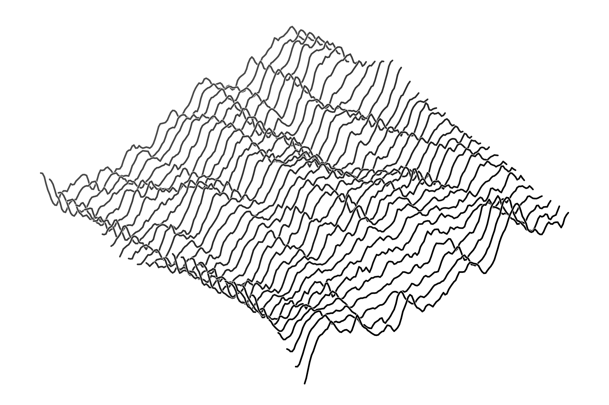

# Isometric Map

(0,0,0) is mapped to (0,0)

x is up and right
y is up
z is up and to the left

Assumes usual canvas where 'up' is negative...



## Build

```
npm run build
```

## Tests

```
npm test
```
